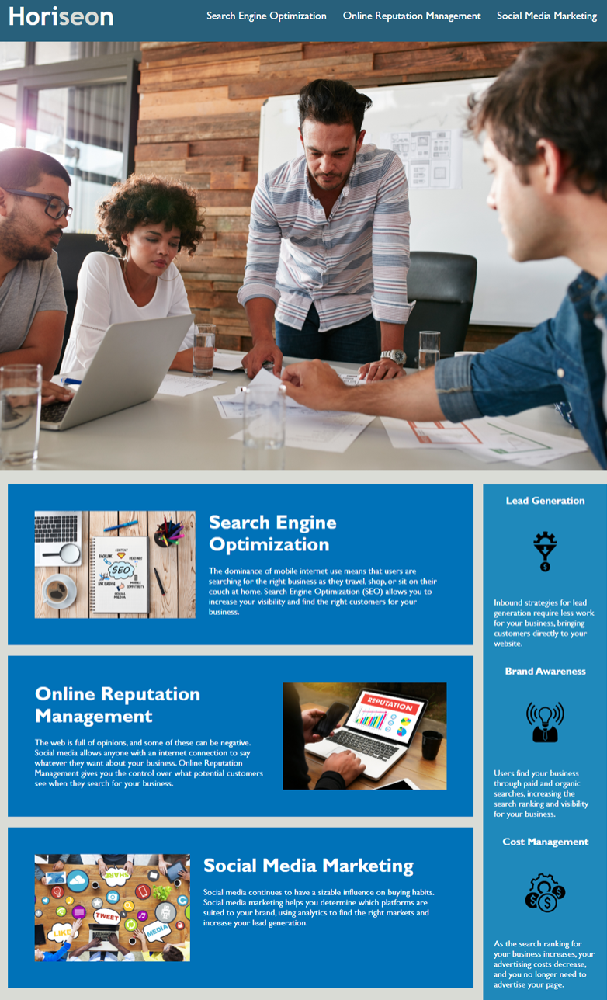

# Horiseon code refactor 

## Description

Having good accessability is an expectation among websites.

The idea behind this project, is to aid Horiseon (a growing marketing agency)in creating a codebase for their website that meets and follows high accessibility standards.

I changed many elements in the HTML and CSS files including semantic elements and new creating classes and reuseability. I also added ALT attributes for all of the images and made sure the CSS file followed the new rules applied to the HTML so the website loads as expected. 

# Working links 

# Screenshot of webpage

